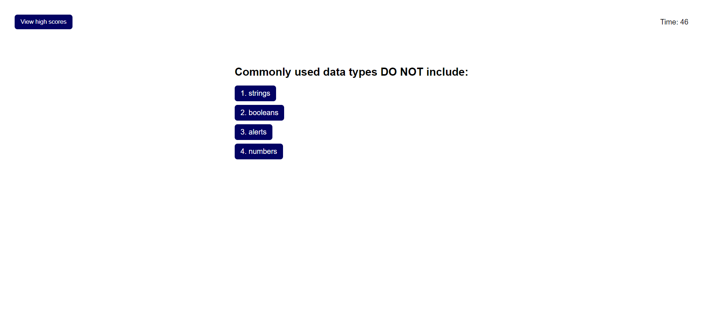

# Code-Quiz

## Description

The Code Quiz project is a five question quiz built from the ground up using HTML, CSS, and JavaScript. This project exercises skills in writing JavaScript code that can dynamically update the webpage's HTML and CSS through the use of event listeners and click events. Building this project not only improves code writing skills, but also improves coding theory knowledge that will aid in preparation for technical interviews.

[Code Quiz](https://codehashira28.github.io/Code-Quiz/)

## Installation

N/A

## Usage

The Code Quiz opens up with an introductory page with "Code Quiz Challenge" heading and a paragraph containing quiz instructions. Once the quiz starts, the user will be timed to complete answering all five questions and a score will be given once all questions are answered or time runs out. Time will be deducted 10 seconds for every question answered incorrectly. At the end of the quiz, the user will be given their score and will be prompted to enter their initials so their score can be added to the high scores list. Once submitted, the user is shown a high scores page that displays all participating scores from highest to lowest scores. 

## Credits

https://dmitripavlutin.com/javascript-array-sort-numbers/